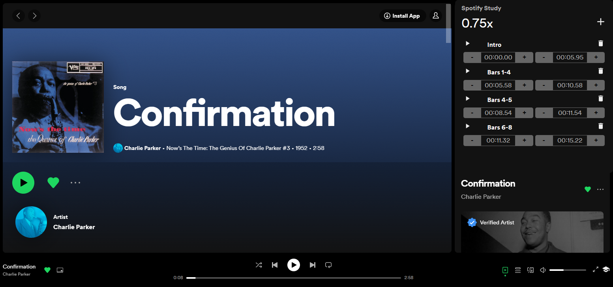

# Spotify Study

Change the tempo and add markers to Spotify tracks

## Usage
---
`-` : Slow down

`+` : Speed up

`*` : Reset speed to 1.0x

`0` : Add section (adds section at currentTime with a length of 5 seconds)

`Del` : Delete current section

`LeftArrow` : Adjust section start time by -1 seconds

`RightArrow` : Adjust section start time by +1 seconds

`UpArrow` : Adjust section end time by +1 seconds

`DownArrow` : Adjust section send time by -1 seconds

## Issues
---
- You must have a track active in the spotify player. 
- Pressing play on a marker will only work if you've pressed play at least once on the actual player. (FIX 1.0)

## RoadMap
---

#### 1.0
- List all available tracks
- Init Spotify Study without reload
- Mobile support

## Credit
---
Built on the great work here: https://github.com/intOrfloat/spotitySpeedExtension